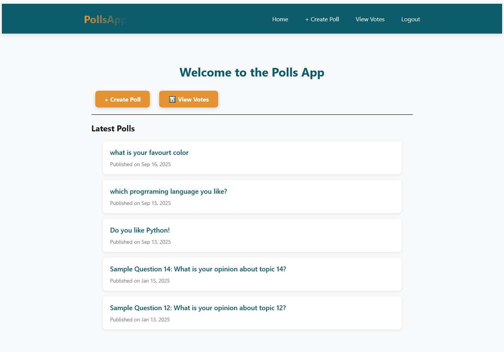
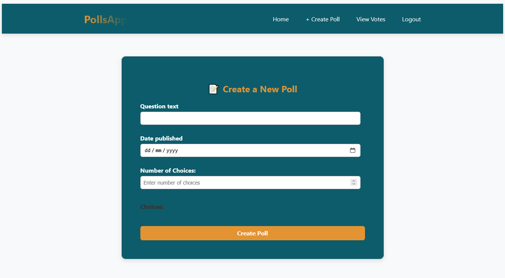
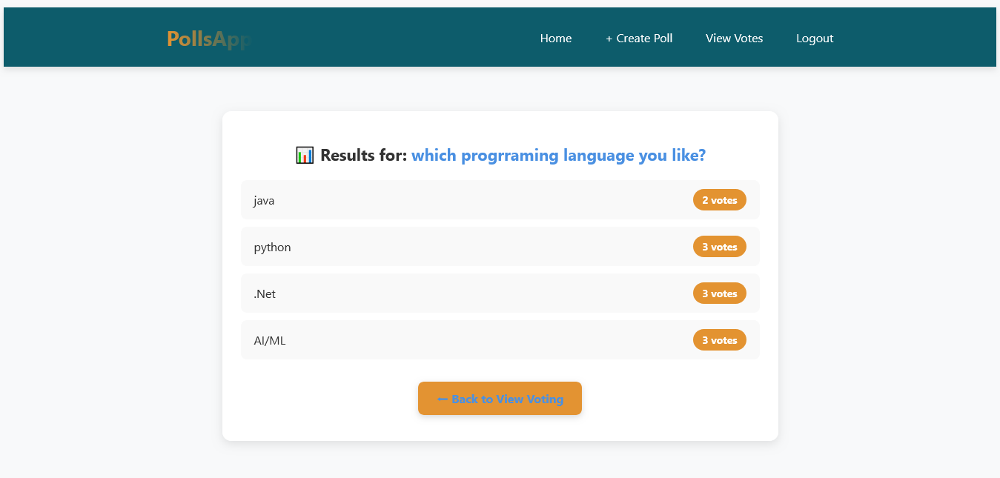

# 📊 Polls App  

A simple **Polls Application** built with **Django** that allows users to create polls, vote on them, and view results.  
This project demonstrates authentication, admin/student roles, form handling, template rendering, and database integration in Django.  

---

## 🚀 Features  

- 🔐 **User Authentication**  
  - Signup & Login system  
  - Two roles: **Admin** & **Student**  

- 📝 **Poll Management**  
  - Admins can create polls with multiple choices  
  - Students can view polls and cast votes  

- 📊 **Voting System**  
  - Each student can vote once per poll  
  - Real-time results with vote counts  

- 🎨 **Custom Styling (No Bootstrap)**  
  - Clean and professional UI using only CSS  
  - Responsive navigation bar and improved templates  

---

## 🛠 Tech Stack  

- **Backend:** Django 4.x  
- **Frontend:** HTML, CSS (custom styling)  
- **Database:** SQLite (default, can be swapped for PostgreSQL/MySQL)  
- **Version Control:** Git + GitHub  

---

## ⚙️ Installation  

1. Clone this repository :
--------------------------------------------- 
   ```bash
   git clone https://github.com/your-username/polls-app.git
   cd polls-app

Create and activate a virtual environment:
---------------------------------------------
python -m venv venv
venv\Scripts\activate   # On Windows
source venv/bin/activate # On Mac/Linux

Install dependencies:
------------------------------
pip install -r requirements.txt

Apply migrations:
---------------
python manage.py makemigrations
python manage.py migrate

Create a superuser (admin):
------------------------------
python manage.py createsuperuser

Run the development server:
------------------------------
python manage.py runserver

📂 Project Structure:
------------------------------
poll_project/
│── poll/                 # Main Django app
│   ├── migrations/       # Database migrations
│   ├── static/           # CSS & static files
│   ├── templates/        # HTML templates
│   ├── models.py         # Database models
│   ├── views.py          # Application logic
│   └── urls.py           # URL routing
│
├── poll_project/         # Project settings
├── manage.py             # Django CLI
├── requirements.txt      # Python dependencies
└── README.md             # Documentation

📸 Screenshots:
---------------






🤝 Contribution:
------------------

Fork this repo

Create a new branch (feature-new)

Commit changes

Push to your branch

Create a Pull Request

📜 License:
---------------

This project is licensed under the MIT License – you’re free to use, modify, and distribute it.